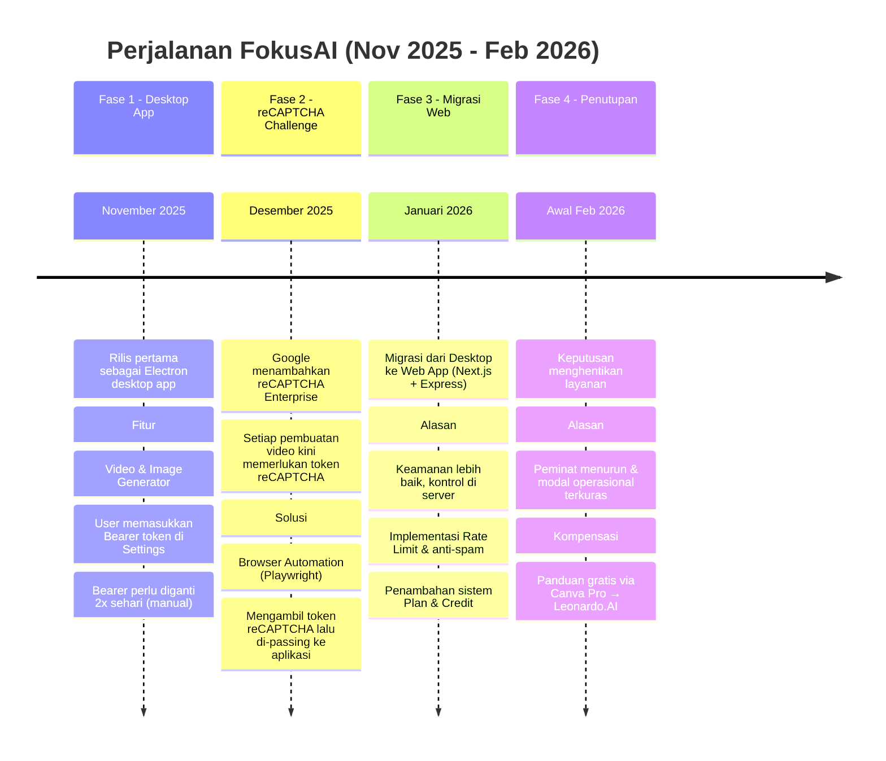
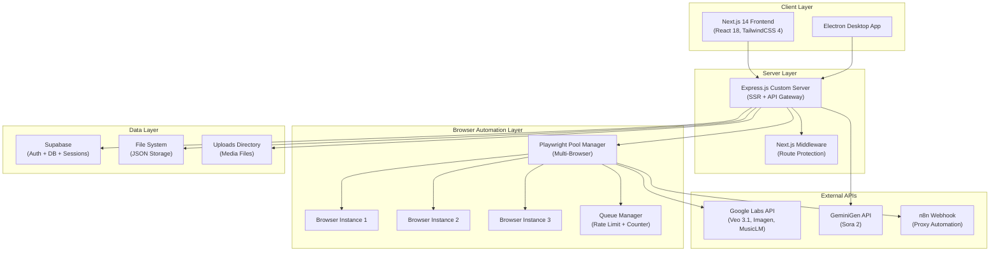
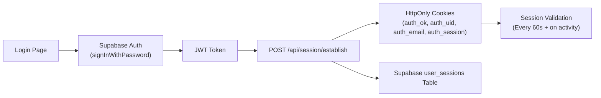
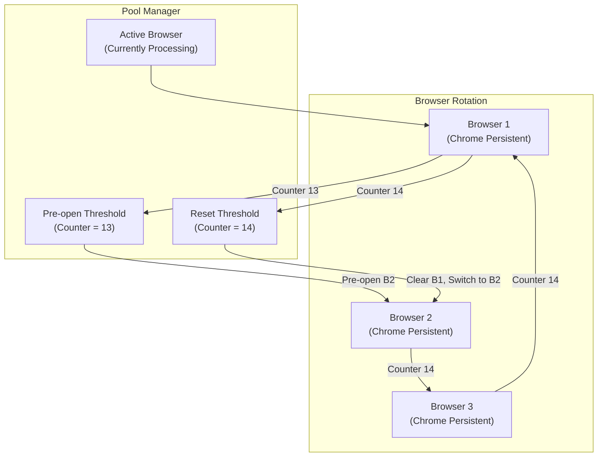
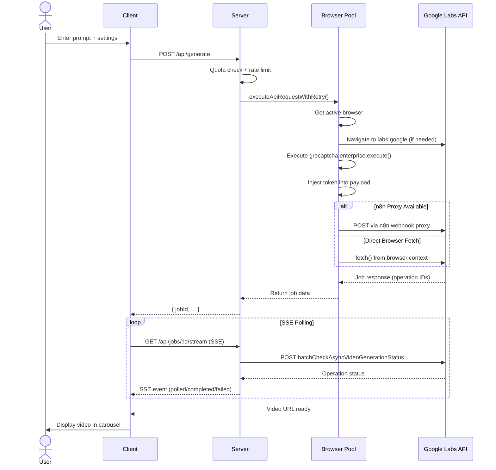
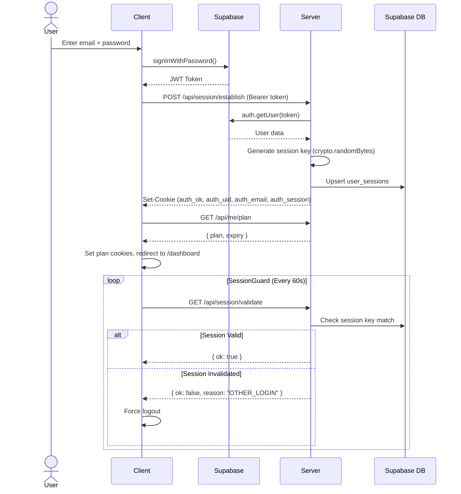

# 📋 Analisis Mendalam Project FokusAI (Nemesis Studio)

> **Tujuan**: Dokumen persiapan interview ODP IT Mandiri — penjelasan teknis dan bisnis secara komprehensif.

---

## 1. 🧭 Gambaran Umum (Executive Summary)

**FokusAI** (internal codename: **Nemesis Studio**) adalah platform **AI Content Generation** berbasis web yang memungkinkan pengguna membuat konten video, gambar, musik, dan UGC (User Generated Content) menggunakan berbagai model AI terkini.

### Identitas Project
| Aspek | Detail |
|-------|--------|
| **Nama Publik** | Nemesis Studio / FokusAI |
| **Versi** | 0.5.0 |
| **Domain** | fokusai.fun / test.nemesisstudio.fun |
| **Tipe Aplikasi** | SaaS Platform (Web + Desktop) |
| **Target User** | Content Creator, UGC Creator, Digital Marketer |
| **Platform** | Web (Next.js), Desktop (Electron), Docker |

### Apa yang Dilakukan Aplikasi Ini?
Aplikasi ini menyediakan satu platform terpusat untuk:
1. **Generate Video AI** — menggunakan Google Veo 3.1 (text/image-to-video)
2. **Generate Video Sora 2** — menggunakan OpenAI Sora 2 via GeminiGen API
3. **Generate Gambar AI** — menggunakan Imagen 4, Nano Banana, Nano Banana Pro
4. **Generate Musik AI** — menggunakan Google MusicLM v2
5. **UGC Generator** — alat pembuatan konten viral (script, storyboard, video pendek)
6. **Video Extend & Reshoot** — perpanjang/modifikasi video yang sudah dihasilkan

---

## 2. 📖 Latar Belakang & Perjalanan Bisnis

### Awal Mula: Melihat Peluang (November 2025)

Pada sekitar **November 2025**, saya mengamati tumbuhnya **bisnis digital yang menjual layanan AI video generator dengan harga yang cukup fantastis** — ratusan ribu hingga jutaan rupiah per paket. Dari situ, saya menyadari bahwa demand terhadap AI video generator ini sangat besar dan terus meningkat.

### Siapa Penggunanya & Untuk Apa?

Target pengguna utama adalah:

| Segmen | Use Case | Masalah yang Dipecahkan |
|--------|----------|------------------------|
| **Affiliator Produk** (TikTok, Shopee, Tokopedia) | Membuat video showcase produk untuk konten affiliate marketing | **Menghilangkan biaya sewa studio foto/video produk** yang mahal. AI bisa menghasilkan video produk profesional hanya dari deskripsi teks. |
| **Content Creator YouTube** | Membuat visual untuk video edukasi, cerita anak, cerita rakyat, animasi | **Memangkas anggaran produksi** yang biasanya memerlukan animator atau stock footage berbayar. |
| **UGC Creator** | Membuat konten viral untuk TikTok, Instagram Reels | **Mempercepat workflow** pembuatan konten tanpa perlu keahlian video editing. |
| **Kreator Cerita** | Cerita anak, dongeng, cerita rakyat, konten edukasi | **Visualisasi cerita** yang sebelumnya hanya bisa dengan ilustrator profesional. |

> [!IMPORTANT]
> **Insight Kunci**: Orang-orang ini bersedia membayar karena biaya menyewa foto studio produk / videografer jauh lebih mahal dibanding langganan AI generator. FokusAI lahir untuk menjembatani gap ini dengan harga yang lebih terjangkau.

### Proses Reverse Engineering

Setelah melihat peluang ini, saya melakukan riset mendalam:

1. **Investigasi**: Mencari tahu bagaimana bisnis digital ini bekerja di balik layar
2. **Temuan**: Mereka mengambil **Authorization Bearer token** dari **Google Flow** (sekarang Google Labs) — khususnya **paket Ultra** yang saat itu memiliki 0 credit cost untuk generate video
3. **Scraping Endpoint**: Saya melakukan reverse engineering terhadap API Google Flow, men-scraping endpoint-endpoint yang digunakan untuk membuat video
4. **Membangun Platform**: Bearer token tersebut kemudian saya integrasikan ke aplikasi yang saya bangun sendiri — **Nemesis Studio**

### Evolusi Platform



### Detail Setiap Fase

#### Fase 1: Desktop App (November 2025)
- **Format**: Aplikasi desktop (Electron) yang harus diinstall
- **Cara Kerja**: User mendapatkan bearer token dari Google Flow dan memasukkannya di halaman Settings
- **Kendala**: Bearer token harus diganti **2 kali sehari** (expired cepat)
- **Hasil**: Berjalan lancar selama ~1 bulan

#### Fase 2: reCAPTCHA Challenge (Desember 2025)
- **Masalah**: Google menambahkan keamanan **reCAPTCHA Enterprise** pada setiap request pembuatan video
- **Dampak**: Bearer token saja tidak cukup, perlu reCAPTCHA token yang hanya bisa didapat dari browser
- **Solusi**: Mengembangkan **browser automation** menggunakan Playwright untuk:
  1. Membuka browser otomatis ke Google Labs
  2. Menjalankan `grecaptcha.enterprise.execute()` di browser context
  3. Mengambil token reCAPTCHA yang dihasilkan
  4. Meng-inject token tersebut ke request API
- **Ini adalah titik balik teknis terbesar** — dari simple API proxy menjadi browser automation platform

#### Fase 3: Migrasi ke Web (Januari 2026)
- **Motivasi**: Desktop app kurang aman (bearer token di tangan user), perlu kontrol lebih
- **Perubahan**:
  - Migrasi ke **Next.js (web app)** agar bisa diakses dari mana saja
  - Bearer token disimpan di **server** (bukan di user)
  - Penambahan **rate limit** (2 menit cooldown per user) agar tidak dispam
  - Implementasi **Plan system** (Free, Lifetime, Monthly, dll.)
  - Supabase untuk **user authentication** dan session management
- **Keunggulan**: Lebih aman, user tidak perlu repot ganti bearer

#### Fase 4: Penutupan & Kompensasi (Februari 2026)
- **Alasan Berhenti**:
  1. **Peminat mulai menurun** — pasar mulai jenuh dengan kompetitor
  2. **Modal operasional terkuras** — biaya VPS, bandwidth, dan maintenance Playwright browser pool
- **Kompensasi untuk User**: Menyediakan **panduan gratis** bagi user untuk tetap bisa generate video menggunakan jalur alternatif: **Canva Pro/Bisnis** yang terhubung ke **Leonardo.AI**
- **Pelajaran**: Belajar tentang product-market fit, burn rate, dan kapan harus pivot

### Model Revenue yang Digunakan

```
Revenue Streams:
├── Plan Veo Lifetime (One-time purchase)
│   └── Akses seumur hidup ke Veo video + image generator
├── Plan Veo + Sora Unlimited (Credit-based)
│   └── Akses semua fitur + Sora 2 dengan sistem kredit
├── Plan Monthly (Subscription)
│   └── Akses penuh selama 30 hari
└── Credit Top-up
    └── User bisa membeli kredit tambahan untuk Sora 2
```

---

## 3. 🏗️ Arsitektur Sistem

### High-Level Architecture



### Arsitektur Detail

Aplikasi menggunakan **Custom Express Server** yang meng-host Next.js SSR sekaligus menyediakan REST API. Ini bukan arsitektur Next.js standar; server Express menangani:

1. **Next.js SSR Rendering** — meng-handle semua halaman React
2. **API Proxy Layer** — mem-proxy request ke Google Labs API dan Sora API
3. **Browser Automation** — menjalankan Playwright browser pool untuk bypass reCAPTCHA
4. **Session Management** — dual-layer (cookies + Supabase DB)
5. **Credit & Plan System** — manajemen paket dan kredit per user
6. **File Operations** — upload, download, video concat via FFmpeg

---

## 4. 🛠️ Technology Stack

### Frontend
| Technology | Version | Purpose |
|------------|---------|---------|
| **Next.js** | 14.2.x | React framework, SSR, routing |
| **React** | 18.2.x | UI component library |
| **TailwindCSS** | 4.1.x | Utility-first CSS framework |
| **Framer Motion** | 12.23.x | Animations & page transitions |
| **GSAP** | 3.14.x | Advanced scroll animations |
| **Three.js + R3F** | 0.182.x | 3D graphics (landing page) |
| **Tabler Icons** | 3.36.x | Icon library |
| **Google Fonts** | Inter, Outfit | Typography |

### Backend
| Technology | Version | Purpose |
|------------|---------|---------|
| **Express.js** | 4.19.x | HTTP server, API routing, middleware |
| **Playwright** | 1.49.x | Headless browser automation |
| **FFmpeg** (fluent) | 2.1.x | Video processing (concat) |
| **Supabase JS** | 2.86.x | Auth, Database, Admin API |
| **Google Generative AI** | 0.24.x | Gemini API integration |
| **dotenv** | 16.4.x | Environment configuration |
| **cors** | 2.8.x | Cross-origin resource sharing |

### Desktop
| Technology | Version | Purpose |
|------------|---------|---------|
| **Electron** | 30.x | Desktop app wrapper |
| **electron-builder** | 24.x | Packaging & distribution |

### Infrastructure
| Technology | Purpose |
|------------|---------|
| **Docker** | Containerization (Xvfb + noVNC) |
| **Nginx** | Reverse proxy, SSL termination |
| **PM2** | Process management on VPS |
| **Supabase Cloud** | BaaS (Auth + PostgreSQL) |
| **n8n** | Workflow automation proxy |
| **SumoPod Singapore** | VPS hosting (43.134.5.41) |

---

## 5. 📁 Struktur Direktori

```
fokusai/
├── app/                        # Next.js App Router (Frontend)
│   ├── layout.jsx              # Root layout (providers, guards)
│   ├── page.jsx                # Root → redirect to /landing
│   ├── globals.css             # 126KB global styles
│   ├── landing/                # Landing page (marketing)
│   │   ├── page.jsx            # Server component, lazy-loaded sections
│   │   └── components/         # 18 modular components
│   │       ├── HeroSection.jsx
│   │       ├── FeaturesSection.jsx
│   │       ├── PricingSection.jsx
│   │       ├── TestimonialSection.jsx
│   │       ├── ShowcaseSection.jsx
│   │       └── ...
│   ├── login/                  # Authentication page
│   ├── register/               # Registration page
│   ├── dashboard/              # User dashboard
│   ├── prompt-tunggal/         # Single video generator (Veo 3.1)
│   │   ├── page.jsx            # Main page with carousel + prompt bar
│   │   └── components/         # FloatingPromptBar, SettingsPanel, etc.
│   ├── prompt-batch/           # Batch video generation
│   ├── sora2/                  # Sora 2 video generator
│   ├── image-generator/        # AI image generation
│   ├── ugc-generator/          # UGC tools hub
│   │   ├── viral-short-video/  # Viral shorts generator
│   │   ├── magic-writer/       # Script writer
│   │   └── storyboard-studio/  # Storyboard tool
│   ├── musik/                  # AI music generation (MusicLM)
│   ├── frame-ke-video/         # Frame-to-video conversion
│   ├── browser-mode/           # Admin browser pool control
│   ├── admin/                  # Admin panel
│   │   └── users/              # User management (CRUD, plans, credits)
│   ├── profile/                # User profile
│   ├── credit/                 # Credit/plan management
│   ├── context/                # React Context (SettingsContext)
│   ├── hooks/                  # Custom hooks
│   │   ├── useVideoGeneration.js   # Video gen lifecycle
│   │   ├── useSoraGenerator.js     # Sora 2 integration
│   │   ├── useImageUpload.js       # Image upload to Labs
│   │   ├── useQuota.js             # Daily quota tracking
│   │   └── usePrefetchRoutes.js    # Route prefetching
│   ├── components/             # Shared UI components
│   │   ├── AppNavbar.jsx/.css
│   │   ├── VideoCarousel.jsx/.css
│   │   ├── ErrorModal.jsx
│   │   ├── GlobalBackgrounds.jsx
│   │   └── modals/
│   ├── lib/                    # Client libraries
│   ├── utils/                  # Client utilities (quota, payloader)
│   ├── SessionGuard.jsx        # Session validation component
│   ├── PlanSync.jsx            # Realtime plan sync (SSE)
│   ├── CrossTabLogout.jsx      # Cross-tab session management
│   ├── PageTransition.jsx      # Animated page transitions
│   └── ScrollPerf.jsx          # Scroll performance optimizer
│
├── server/                     # Express Backend
│   ├── index.js                # Main server (3976 lines!)
│   ├── playwright-pool.js      # Multi-browser pool manager
│   ├── playwright-veo.js       # Single browser automation
│   ├── browser-pool.js         # Browser state management
│   ├── queue-manager.js        # Rate limiting & counter
│   ├── config/
│   │   └── labsEndpoints.js    # Google Labs API endpoints
│   └── utils/
│       ├── storage.js          # File-based JSON storage
│       ├── cookies.js          # Cookie parser utilities
│       └── errorResponse.js    # Error handling
│
├── electron/                   # Desktop App
│   └── main.cjs                # Electron main process
│
├── scripts/
│   └── generateRsaKeys.js      # License key generation
│
├── Dockerfile                  # Docker with Xvfb + noVNC
├── docker-entrypoint.sh        # Container startup script
├── fokusai-nginx.conf          # Nginx reverse proxy config
├── deploy-to-vps.bat           # Windows deployment script
├── deploy-vps.sh               # Linux deployment script
├── middleware.js                # Next.js route middleware
└── package.json                # Project dependencies
```

---

## 6. 🔑 Fitur Utama (Core Features)

### 5.1 Video Generator (Veo 3.1)
**Route**: `/prompt-tunggal`

Fitur utama platform — menggunakan **Google Veo 3.1** untuk text-to-video generation.

**Workflow**:
1. User menulis prompt di `FloatingPromptBar`
2. Hook `useVideoGeneration` membangun payload via `buildPayload()`
3. Request dikirim ke `/api/generate` (Express)
4. Server mengirim ke browser pool (`playwright-pool.js`)
5. Browser pool mendapatkan reCAPTCHA token dari `labs.google`
6. Request dikirim ke Google Labs API via n8n proxy atau direct browser fetch
7. Polling status via SSE (`/api/jobs/:id/stream`)
8. Video URL dikembalikan dan ditampilkan di `VideoCarousel`

**Model yang Tersedia**:
- `veo_3_1_t2v_fast_ultra` — Text-to-Video (Default)
- `veo_3_1_t2v_fast_ultra_relaxed` — Relaxed mode (unlimited)
- Video Extend variants (portrait/landscape)
- Video Reshoot

**Fitur Tambahan**:
- **Image-to-Video**: Upload gambar sebagai start/end frame
- **Video Extend**: Perpanjang video dari frame terakhir
- **Camera Position**: Kontrol gerakan kamera
- **Audio Toggle**: Enable/disable audio generation
- **Voice Language**: Pilih bahasa untuk narasi
- **Style Selection**: Pilih style visual (Cinema, Anime, dll)
- **Aspect Ratio**: Landscape, Portrait, Square

### 5.2 Sora 2 Generator
**Route**: `/sora2`

Menggunakan **OpenAI Sora 2** via **GeminiGen API** sebagai provider pihak ketiga.

**Mode**:
- **Basic Mode**: Prompt langsung
- **Advanced Mode**: Subject, Action, Setting, Lighting, Visual Style, Camera Shot, Reference Image

**API Flow**:
1. Client mengirim ke `/api/sora/execute`
2. Server mengirim multipart FormData ke `https://api.geminigen.ai/uapi/v1/video-gen/sora`
3. Job ID disimpan di local JSON storage
4. Webhook diterima di `/api/sora/webhook` atau polling via `/api/sora/status`
5. Status polling menggunakan endpoint history GeminiGen
6. Video URL dikembalikan ke client

**Credit System**: Sora 2 menggunakan sistem kredit (1 credit per standard, 120 per pro).

### 5.3 Image Generator
**Route**: `/image-generator`

AI image generation menggunakan model Google:
- **Nano Banana** — Fast generation
- **Nano Banana Pro** — Higher quality
- **Imagen 4** — Highest quality

**Features**:
- Multi-image batch generation (1–4 images)
- Reference image upload & crop
- Aspect ratio control
- Gallery view with download

### 5.4 Music Generator
**Route**: `/musik`

Menggunakan **Google MusicLM v2** untuk text-to-music generation.

**Features**:
- Prompt-based generation
- 30-second tracks
- Generates 2-3 variations
- Audio preview & download
- Supports WAV, MP3, OGG formats

### 5.5 UGC Generator
**Route**: `/ugc-generator`

Hub untuk alat pembuatan konten viral:
- **Viral Shorts Generator** — Turn product links into video scripts
- **Magic Script Writer** — TikTok/Reels hook & script generation
- **Storyboard Studio** — Visual storyboard planning

Menggunakan **Google Gemini API** dengan user's own API key (stored per-user in localStorage).

### 5.6 Video Operations
- **Video Concat** (`/api/video/concat`): Gabungkan multiple video menggunakan FFmpeg
- **Frame-to-Video** (`/frame-ke-video`): Konversi frame tunggal menjadi video
- **Video Download Proxy**: Download video dari Google Storage via authenticated proxy

---

## 7. 🔐 Sistem Keamanan & Autentikasi

### 6.1 Authentication Stack



**Multi-Layer Session System**:
1. **Supabase Auth** — JWT-based authentication
2. **Server Session Cookies** — HttpOnly, SameSite=Lax (7 day expiry)
3. **Session Validation** — Server-side validation setiap 60 detik
4. **Single-Session Enforcement** — Hanya 1 device per akun (SessionGuard)
5. **Cross-Tab Logout** — Logout di satu tab = logout semua tab

### 6.2 Middleware (Route Protection)

```javascript
// Plan-based access control
const PLANS = {
  FREE: "free",            // Landing, Login, Register, Dashboard, Profile
  VEO_LIFETIME: "veo_lifetime",  // Semua kecuali Sora 2
  VEO_SORA_UNLIMITED: "veo_sora_unlimited", // Semua fitur
  MONTHLY: "monthly",       // Semua (selama belum expired)
  ADMIN: "admin"            // Full access + admin panel
};
```

- **Monthly Plan** auto-downgrade ke Free saat expired
- URL parameter injection untuk plan change **diblokir** (security hardening)
- Protected routes dikonfigurasi di `middleware.js` matcher

### 6.3 Admin System

Admin memiliki akses khusus:
- **Admin Secret Key** — header `x-admin-secret` untuk fast authentication
- **Email Whitelist** — ENV `ADMIN_EMAIL_WHITELIST`
- **Admin Dashboard** — CRUD users, plan management, credit management
- **Realtime Plan Push** — SSE ke user saat plan berubah

### 6.4 Rate Limiting & Queue Management

```
Queue Manager:
├── Generate Counter: 0-14 (auto-reset setelah 14)
├── User Cooldown: 2 menit per user (admin bypass)
├── Browser Refresh Queue: Request di-queue saat browser resetting
└── Generate Logs: Track each generation with user info
```

---

## 8. 🌐 Browser Automation (Playwright Pool)

### Mengapa Perlu Browser Automation?

Google Labs API memerlukan **reCAPTCHA Enterprise token** yang hanya bisa didapatkan dari browser context yang sudah login ke `labs.google`. Tanpa token ini, API mengembalikan 403.

### Arsitektur Browser Pool



**Flow per Request**:
1. Ambil browser aktif dari pool
2. Navigasikan ke `labs.google/fx/tools/video-fx` (jika belum)
3. Execute `grecaptcha.enterprise.execute()` dari browser context
4. Inject token ke payload `clientContext.recaptchaToken`
5. Kirim via n8n proxy (primary) atau browser fetch (fallback)
6. Increment counter; rotate browser jika threshold tercapai

**Retry & Failover**:
- Max 3 retries per browser
- Auto-failover ke browser berikutnya pada 403/500
- Browser data di-clear dan re-launch saat failover

**Konfigurasi**:
- `MAX_BROWSERS=3` (env configurable)
- `PRE_OPEN_AT=13` (pre-open next browser)
- `MAX_GENERATES=14` (reset threshold)
- Chromium persistent context dengan anti-detection flags

---

## 9. 💰 Sistem Bisnis (Plan & Credit)

### Plan Tiers

| Plan | Fitur Akses | Harga Model |
|------|-------------|-------------|
| **Free** | Landing, Dashboard, Profile saja | — |
| **Veo Lifetime** | Semua fitur **kecuali** Sora 2 | One-time purchase |
| **Veo + Sora Unlimited** | Semua fitur + Sora 2 | Credit-based |
| **Monthly** | Semua fitur (30 hari) | Subscription |
| **Admin** | Full access + Admin panel | — |

### Credit System

```
Admin Credits (Global Pool)
    ├── Shared across all admin accounts
    ├── Grant credits to veo_sora_unlimited users
    └── Revoke credits from users

User Credits (Per-User)
    ├── veo_sora_unlimited users get individual credit pool
    ├── Deducted on each Sora 2 generation
    └── Stored in Supabase users.sora2_credits column
```

**Quota Harian (Veo)**: Tracked per-user per-day di localStorage + server-side usage stats.

### Realtime Plan Sync (SSE)

```javascript
// Server-Sent Events untuk plan changes
GET /api/me/plan/stream?token=<jwt>

Events:
- plan_snapshot: Initial plan state
- plan_update: Real-time plan change notification
```

Saat admin mengubah plan user, notifikasi dikirim realtime melalui SSE, dan client (PlanSync.jsx) secara otomatis update UI tanpa refresh.

---

## 10. 🚀 Deployment & Infrastructure

### Deployment Options

#### 1. VPS Deployment (Primary)
```
VPS: SumoPod Singapore (43.134.5.41)
├── SSH Key: id_ed25519
├── Path: /opt/nemesis-studio
├── Process: PM2 (nama: fokusai)
├── Proxy: Nginx (reverse proxy + SSL)
└── Domain: fokusai.fun
```

**Deploy Script** (`deploy-to-vps.bat`):
1. Tar archive (exclude node_modules, .next, browser-data)
2. SCP upload ke VPS
3. Extract on VPS
4. `npm install` + `npm run build`
5. `pm2 restart fokusai`

#### 2. Docker Deployment
```dockerfile
# Fitur khusus: Xvfb + noVNC untuk virtual display
FROM node:20-slim
# Install Chromium dependencies + Xvfb + VNC + noVNC + Fluxbox
# Expose: 8790 (app) + 6080 (noVNC web viewer)
```

Docker image mendukung **headless browser** via Xvfb (X Virtual Framebuffer) sehingga Playwright bisa berjalan di server tanpa display fisik. noVNC menyediakan akses web ke virtual display untuk debugging.

#### 3. Electron Desktop
```
Electron wraps the Express + Next.js server
├── Single instance lock
├── Auto-start server pada launch
├── NSIS installer for Windows
└── Build: electron-builder --win --x64
```

### Nginx Configuration
- Reverse proxy ke `localhost:8790`
- SSE support (disable buffering untuk `/api/me/plan/stream`)
- WebSocket support (untuk Next.js hot reload)
- Gzip compression
- 100MB max upload size

---

## 11. 📊 Database Schema (Supabase)

### Tabel `users`
| Column | Type | Purpose |
|--------|------|---------|
| `id` | UUID | Primary key (from auth) |
| `email` | text | User email |
| `full_name` | text | Display name |
| `plan` | text | Current plan tier |
| `sora2_credits` | bigint | Sora 2 credit balance |
| `created_at` | timestamp | Registration date |
| `updated_at` | timestamp | Last update |

### Tabel `user_sessions`
| Column | Type | Purpose |
|--------|------|---------|
| `user_id` | UUID | FK to users.id |
| `session_key` | text | Random session token |
| `email` | text | Associated email |
| `updated_at` | timestamp | Last session update |

### Auth Metadata (user_metadata)
| Field | Purpose |
|-------|---------|
| `plan` | Cached plan for middleware |
| `planExpiry` | Expiry timestamp for monthly plans |
| `name` | Display name |

### File-based Storage (JSON)
| File | Purpose |
|------|---------|
| `uploads-meta.json` | Media ID mappings |
| `user-credits.json` | Fallback credit storage |
| `usage-stats.json` | Per-user generation stats (daily + total) |
| `sessions.json` | Fallback session storage |
| `sora-jobs.json` | Sora 2 job tracking |
| `activation-state.json` | License state |

---

## 12. 🧩 Pola Desain & Best Practices

### Custom Hooks Architecture
```
useVideoGeneration()
├── State: isGenerating, status, progress, result
├── Generate workflow: quota check → build payload → submit → SSE poll
├── SSE events: queued, started, polled, completed, failed, bearer_expired
└── Quota integration: auto-deduct on completion

useSoraGenerator()
├── State: mode, prompt (basic/advanced fields), result
├── Generate: FormData → /api/sora/execute → poll status
├── Credit deduction: /api/credits/deduct
└── Image reference support

useImageUpload()
├── Multi-image support (start + end frame)
├── Aspect ratio auto-detection
├── Upload to Labs API with media ID persistence
└── Media ID caching in server metadata

useQuota()
├── Daily quota tracking per generation type
├── localStorage-based (client) + server stats
├── Admin bypass support
└── Reset detection (daily)
```

### Resilience Patterns
1. **Graceful Shutdown** — SIGTERM/SIGINT handlers, browser pool cleanup
2. **Uncaught Exception Handler** — Log but don't crash
3. **Multi-fallback Upload** — 15+ payload format candidates untuk Google API
4. **Browser Failover** — Auto-switch ke browser lain saat 403/500
5. **Dual Storage** — Supabase primary, JSON file fallback
6. **Session Caching** — Skip validation jika < 30 detik sejak terakhir

### Performance Optimizations
1. **Dynamic Imports** — Landing page sections lazy-loaded
2. **Route Prefetching** — `usePrefetchRoutes()` hook
3. **ScrollPerf** — Scroll performance optimizer component
4. **Font Optimization** — `next/font/google` untuk Inter, Outfit
5. **SSE Throttling** — Skip JSON.parse jika < 100ms sejak terakhir
6. **Image Optimization** — Next.js Image component

---

## 13. 🎨 Design System

### Color Palette
```
Primary Gold:     #D4AF37 (accent, CTA, highlights)
Dark Gold:        #B58E00 (gradients, hover)
Muted Gold:       #9A8B4F (secondary text, borders)
Deep Black:       #0A0A0A (backgrounds)
Charcoal:         #141414 (card backgrounds)
White Soft:       #F5F5F5 (primary text)
```

### UI Patterns
- **Glassmorphism**: backdrop-filter blur, semi-transparent backgrounds
- **Gold Gradient CTAs**: Linear gradients from #FFD700 to #D4AF37
- **Dark Mode Only**: Seluruh UI dirancang untuk dark mode
- **Premium Aesthetic**: Corner decorations, floating particles, glow effects
- **Responsive Design**: Mobile-first, hamburger menu, adaptive grid

---

## 14. ⚠️ Keterbatasan & Tantangan Teknis (Honest Assessment)

> [!NOTE]
> Section ini sengaja ditulis secara jujur dan kritis. Saat interview, kemampuan mengenali kekurangan sendiri menunjukkan **kedewasaan profesional** dan **growth mindset**.

### A. Kekurangan Arsitektur

| # | Masalah | Dampak | Kategori |
|---|---------|--------|----------|
| 1 | **Server Monolith** — `server/index.js` = 3.976 baris dalam 1 file | Sulit di-maintain, debug, dan di-test. Satu perubahan kecil berisiko mempengaruhi keseluruhan server. | Architecture |
| 2 | **Tidak ada API Versioning** — semua endpoint langsung di `/api/*` tanpa versioning | Breaking changes ke client saat update API. Tidak bisa roll back endpoint lama. | Architecture |
| 3 | **No Separation of Concerns** — routing, business logic, dan database access di file yang sama | Melanggar prinsip Clean Architecture / MVC. Sulit untuk onboard developer baru. | Architecture |
| 4 | **Custom Express Server** — Next.js di-host di atas Express custom | Tidak bisa menggunakan fitur Next.js terbaru (App Router API routes, middleware edge runtime). Deployment lebih kompleks. | Architecture |

### B. Kekurangan Keamanan

| # | Masalah | Dampak | Kategori |
|---|---------|--------|----------|
| 5 | **Bearer Token Management** — token Google Labs bisa expired kapan saja | Saat token expired, seluruh service generate video down. Perlu manual refresh. | Security |
| 6 | **Credentials di Codebase** — `.env.server.local` dengan real credentials masih tercatat di project | Risiko kebocoran credentials jika repository tidak dikelola dengan baik. | Security |
| 7 | **Admin Secret Key Statis** — `ADMIN_SECRET` sebagai env variable tetap | Tidak ada rotasi key otomatis, key yang bocor bisa dipakai selamanya. | Security |
| 8 | **localStorage untuk API Key** — UGC Generator menyimpan Gemini API key user di browser | Rentan terhadap XSS attack. Seharusnya disimpan di server-side encrypted store. | Security |
| 9 | **Dual Storage Inconsistency** — Supabase primary + JSON file fallback | Data bisa tidak sinkron antara database dan file system jika salah satu gagal write. | Data Integrity |

### C. Kekurangan Scalability & Reliability

| # | Masalah | Dampak | Kategori |
|---|---------|--------|----------|
| 10 | **Browser Automation Fragile** — bergantung pada reCAPTCHA Google yang bisa berubah kapan saja | Jika Google mengubah reCAPTCHA flow, seluruh sistem harus di-reverse engineer ulang. | Reliability |
| 11 | **In-Memory State** — job queue, session cache, dan browser state di RAM | Server restart = kehilangan semua job yang sedang antri dan state browser pool. | Scalability |
| 12 | **Vertical Scaling Only** — browser pool hanya bisa berjalan di 1 server | Tidak bisa horizontal scaling. Di-limit oleh RAM/CPU server yang menjalankan Playwright. | Scalability |
| 13 | **No Persistent Queue** — job queue tidak menggunakan Redis/RabbitMQ | Request yang gagal saat server restart hilang permanent. Tidak ada dead letter queue. | Reliability |
| 14 | **Ketergantungan APIs Pihak Ketiga** — Google Labs, GeminiGen, Supabase | Single point of failure. Jika salah satu service down, fitur terkait ikut mati. | Reliability |

### D. Kekurangan UX & Code Quality

| # | Masalah | Dampak | Kategori |
|---|---------|--------|----------|
| 15 | **Mixed Language** — UI campur Bahasa Indonesia dan English | Inconsistent user experience. Tidak profesional jika masuk pasar internasional. | UX |
| 16 | **No Automated Testing** — tidak ada unit test, integration test, atau E2E test | Setiap perubahan kode bisa introducing bugs tanpa deteksi. Regressions tidak tertangkap. | Quality |
| 17 | **No CI/CD Pipeline** — deploy manual via `deploy-to-vps.bat` / SCP | Deploy rawan human error. Tidak ada automated build validation sebelum deploy. | DevOps |
| 18 | **No Database Migrations** — schema Supabase dikelola manual | Sulit tracking schema changes. Tidak bisa rollback schema dengan mudah. | Data |
| 19 | **No Logging Framework** — hanya `console.log` untuk semua logging | Tidak ada log level (debug/info/warn/error), tidak ada structured logging, tidak ada log aggregation. | Observability |
| 20 | **No Monitoring & Alerting** — tidak ada Sentry, Datadog, atau sejenisnya | Error di production tidak terdeteksi sampai user lapor manual. | Observability |

### E. Kekurangan Bisnis

| # | Masalah | Dampak |
|---|---------|--------|
| 21 | **Reverse Engineering Dependency** — API Google Labs tidak memiliki dokumentasi publik resmi | Bisnis dibangun di atas API yang bisa berubah/ditutup tanpa notice. Sangat high risk. |
| 22 | **Burn Rate Tinggi** — biaya VPS + bandwidth untuk Playwright browser pool | Operational cost tidak sustainable tanpa volume user yang besar. |
| 23 | **Market Timing** — pasar AI video generator sangat dinamis dan cepat berubah | Kompetitor bermunculan, model AI native jadi lebih mudah diakses langsung oleh end user. |
| 24 | **Single Revenue Stream** — bergantung pada satu sumber pendapatan (subscription/credit) | Tidak ada diversifikasi revenue (e.g., API access, white-label, enterprise tier). |

### Improvement Roadmap (Jika Dilanjutkan)

```
Priority 1 (Critical - Architecture):
├── Modularisasi server → routes/, controllers/, services/, middleware/
├── Implementasi ORM (Prisma/Drizzle) + database migrations
└── Migrasi job queue ke Redis (BullMQ) untuk persistence

Priority 2 (High - Quality & DevOps):
├── Setup Jest + Playwright E2E testing
├── CI/CD pipeline (GitHub Actions)
├── Structured logging (Winston/Pino) + error tracking (Sentry)
└── API versioning (/api/v1/...)

Priority 3 (Medium - Security):
├── Server-side encrypted storage untuk user API keys
├── Admin key rotation mechanism
├── Rate limiter per IP (express-rate-limit)
└── Security audit & dependency scanning

Priority 4 (Nice to Have - Scale):
├── Horizontal scaling support (Redis shared state)
├── CDN untuk static assets
├── Caching layer (Redis) untuk API responses
└── Multi-region deployment
```

---

## 15. 🎤 Interview Talking Points

### Narasi Pembuka (Ceritakan Perjalanan)

> "Pada November 2025, saya melihat maraknya bisnis digital yang menjual layanan AI video generator dengan harga fantastis. Saya menganalisis bahwa ada demand besar dari affiliator TikTok/Shopee yang butuh video produk tanpa harus sewa studio foto mahal, serta content creator YouTube yang butuh visual untuk cerita edukasi dan konten viral.
>
> Dari situ saya melakukan reverse engineering terhadap API Google Flow — men-scraping endpoint dan memahami cara kerja autorisasinya. Saya membangun **Nemesis Studio**, sebuah platform SaaS full-stack menggunakan **Next.js 14 dan Express.js**, yang mengintegrasikan **Google Veo 3.1** dan **OpenAI Sora 2** untuk video generation.
>
> Platform ini beroperasi komersial selama 3 bulan (November 2025 – Februari 2026) dengan evolusi dari desktop app ke web app, dan saya harus beradaptasi secara real-time ketika Google menambahkan reCAPTCHA Enterprise di Desember 2025 — yang saya tangani dengan membangun **Playwright browser automation pool**."

### Key Technical Points yang Menonjol

#### 1. Problem Solving: reCAPTCHA Challenge → Browser Pool
> "Saat Google menambahkan reCAPTCHA Enterprise di Desember 2025, saya tidak menyerah. Saya membangun **Playwright browser pool** yang mengelola 3 browser instances secara round-robin. Setiap browser bisa handle 14 generasi sebelum auto-rotate, dengan pre-opening browser berikutnya di counter 13 untuk zero-downtime. Ini termasuk retry mechanism (3x per browser) dan failover ke browser lain jika satu gagal."

#### 2. Adaptability: Desktop → Web Migration
> "Saya menyadari desktop app kurang aman karena bearer token ada di tangan user, sehingga saya melakukan migrasi ke arsitektur web. Ini bukan sekadar porting UI — saya harus re-architect keseluruhan sistem: memindahkan secret management ke server, membuat session system multi-layer (Supabase JWT + HttpOnly cookies + session validation), dan menambahkan rate limiting."

#### 3. Business Acumen: Revenue Model & Plan System
> "Saya merancang tiered pricing (Free, Veo Lifetime, Veo+Sora Unlimited, Monthly) dengan credit system. Admin dashboard memungkinkan real-time plan management yang langsung ter-push ke client melalui Server-Sent Events. Ini menunjukkan bahwa saya tidak hanya bisa membangun aplikasi, tapi juga merancang business model SaaS."

#### 4. Self-Awareness: Knowing When to Stop
> "Di Februari 2026, saya membuat keputusan matang untuk menghentikan layanan karena peminat menurun dan modal operasional terkuras. Sebagai kompensasi, saya memberikan panduan gratis ke user menggunakan Canva Pro → Leonardo.AI. Ini mengajarkan saya tentang product-market fit, burn rate management, dan pentingnya pivoting tepat waktu."

### Pertanyaan yang Mungkin Ditanya & Jawaban

**Q: Kenapa pakai Custom Express Server, bukan Next.js API Routes biasa?**
> A: Karena platform membutuhkan Playwright browser automation yang bersifat long-running dan stateful, serta SSE streaming untuk real-time polling. Next.js API routes bersifat serverless/ephemeral yang tidak cocok untuk mengelola browser instances persisten.

**Q: Bagaimana mengelola scaling dengan browser automation?**
> A: Browser pool bersifat round-robin dengan max 3 instances (configurable via env). Untuk scaling horizontal, idealnya menggunakan Redis untuk shared state — ini salah satu improvement yang saya sadari perlu dilakukan.

**Q: Apa kelemahan platform ini?**
> A: Kelemahan utama ada di arsitektur monolith (server 3.976 baris dalam 1 file), ketergantungan pada API tanpa dokumentasi resmi (high risk), dan tidak adanya automated testing. Jika dikembangkan lagi, prioritas pertama saya adalah modularisasi server dan setup CI/CD pipeline.

**Q: Kenapa dihentikan? Apakah itu kegagalan?**
> A: Saya tidak melihatnya sebagai kegagalan murni. Platform berjalan komersial selama 3 bulan, saya belajar banyak tentang arsitektur production-grade, reverse engineering, business model SaaS, dan yang paling penting — kapan harus berhenti. Itu salah satu keputusan terberat tapi paling dewasa yang saya buat.

**Q: Apa yang akan kamu lakukan berbeda jika memulai ulang?**
> A: Tiga hal: (1) Menggunakan arsitektur modular dari awal dengan proper separation of concerns, (2) Tidak bergantung pada API tanpa dokumentasi publik — lebih baik menggunakan official API berlisensi, (3) Setup monitoring dan CI/CD dari day one agar scaling lebih mudah.

---

## 16. 📐 Diagram Alur Key Workflows

### Video Generation Flow



### Login & Session Flow



---

> [!TIP]
> **Untuk Interview**: Gunakan **Section 2** (Latar Belakang) sebagai narasi pembuka untuk menunjukkan business thinking, **Section 15** (Interview Talking Points) sebagai inti jawaban teknis, dan **Section 14** (Keterbatasan) untuk menunjukkan self-awareness dan growth mindset. Fokuslah pada **cerita evolusi** (Desktop → Web → Shutdown) karena ini menunjukkan kemampuan adaptasi dan kedewasaan profesional.
